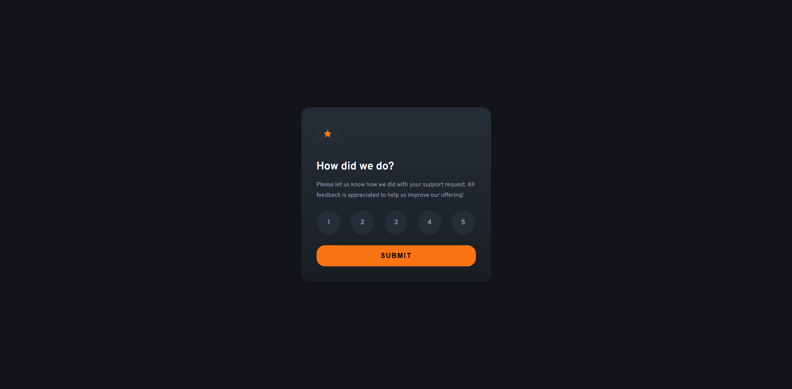

# Frontend Mentor - Interactive rating component solution

This is a solution to the [Interactive rating component challenge on Frontend Mentor](https://www.frontendmentor.io/challenges/interactive-rating-component-koxpeBUmI). Frontend Mentor challenges help you improve your coding skills by building realistic projects.

## Table of contents

- [Overview](#overview)
  - [The challenge](#the-challenge)
  - [Screenshot](#screenshot)
  - [Links](#links)
- [My process](#my-process)
  - [Built with](#built-with)
  - [What I learned](#what-i-learned)
  - [Continued development](#continued-development)
- [Author](#author)

## Overview

### The challenge

Users should be able to:

- View the optimal layout for the app depending on their device's screen size
- See hover states for all interactive elements on the page
- Select and submit a number rating
- See the "Thank you" card state after submitting a rating

### Screenshot



### Links

- Solution URL: [Add solution URL here](https://your-solution-url.com)
- Live Site URL: [Add live site URL here](https://your-live-site-url.com)

## My process

### Built with

- Semantic HTML5 markup
- CSS custom properties
- Flexbox

### What I learned

Another frontend challenge that I saw a potential to practice my frontend skills. I noticed that I could add some simple animations in the thank you card but having a little experience in using animation was deemed hard for me to do.

I did some small searching and found out this neat little trick without using display hidden which would not render transitions/animations on the webpage.

```css
.state {
  opacity: 0;
  pointer-events: none;
  visibility: hidden;
  position: absolute;
}

.state.active {
  opacity: 1;
  pointer-events: all;
  visibility: visible;
  position: relative;
}
```

What this code snippet does is the state class positions the element absolutely which ignores the display flex and other flex properties from the parent element. I was having trouble with this one (before I applied the trick), because the parent element has flex, even with the opacity, pointer-events, and visibility in effects the whole layout was not right (the ratings component were not centered). However, with the position set to absolute, the state class makes the element ignore current flex and have its component positioned absolutely from somewhere (it doesn't matter where as long as it doesn't show if not rendered yet and won't mess with the whole layout).

### Continued development

I will try to improve my animation skills because I'm planning to have a beautifully animated sections in my webpage before I make my own portfolio (I'm also panning to learn some 3rd party APIs/libraries such as three.js and/or GSAP/anime.js).

### Useful resources

- [Example resource 1](https://www.example.com) - This helped me for XYZ reason. I really liked this pattern and will use it going forward.
- [Example resource 2](https://www.example.com) - This is an amazing article which helped me finally understand XYZ. I'd recommend it to anyone still learning this concept.

## Author

- Frontend Mentor - [@yourusername](https://www.frontendmentor.io/profile/yourusername)
